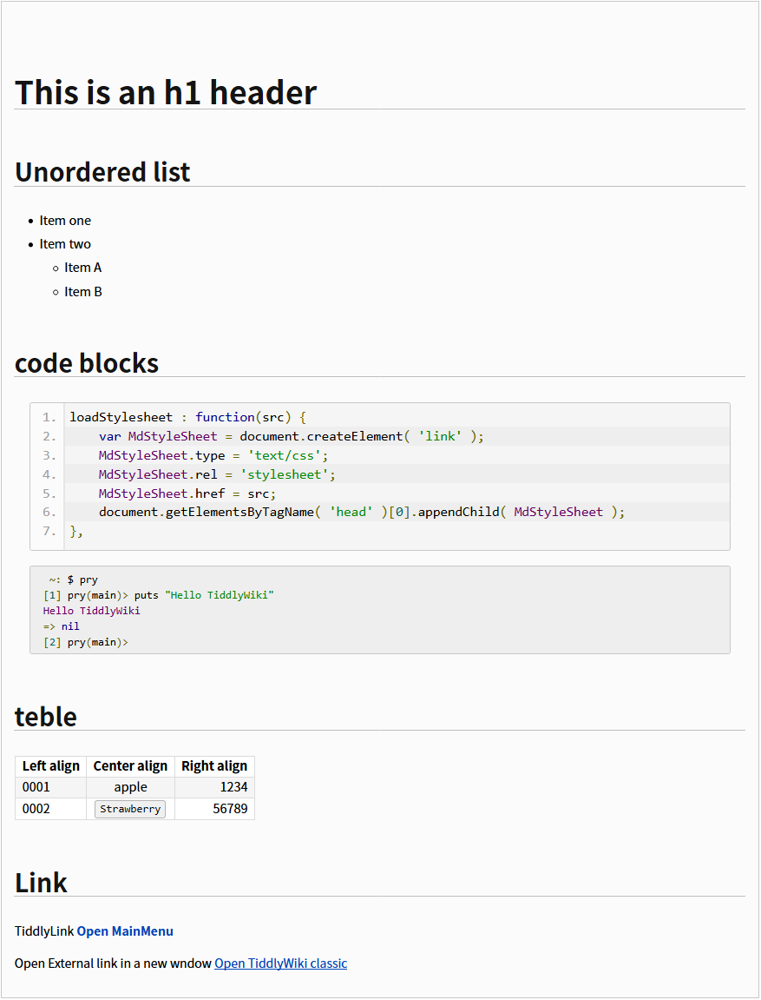

# Markdown plugin for TiddlyWiki Classic


## Description 

*   allows to write in the [GFM](https://help.github.com/articles/github-flavored-markdown) notation.
*   allows to [syntax highlighting](https://github.com/google/code-prettify) of source code snippets for 
`<pre>` code blocks.  
*   This plugin adds a new formatter for `<pre class='prettyprint linenums'>` within the Markdown contents. 


This plugin are adapted from ShowDown.js (on [TiddlyWikiPlugins/ShowDown.js](https://github.com/tobibeer/TiddlyWikiPlugins/blob/master/plugins/ShowDown.js)
).  
Thanks [tobibeer/TiddlyWikiPlugins](https://github.com/tobibeer/TiddlyWikiPlugins).

Changes from the original
*   Change Markdown parser from ShowDown to marked.
*   Added syntax highlighting.
*   Added stylesheet for Markdown.


#### Markdown Plugin and demo, on the icm7216.github.io.

*   [Markdown Plugin](https://icm7216.github.io/MyTiddlyWiki/#PluginMarkdown)
*   [GitHub Flavored Markdown](https://icm7216.github.io/MyTiddlyWiki/#%5B%5BGitHub%20Flavored%20Markdown%5D%5D
)
*   [Markdown Documentation](https://icm7216.github.io/MyTiddlyWiki/#%5B%5BMarkdown%20Documentation%5D%5D)
*   [MathJax in Markdown](https://icm7216.github.io/MyTiddlyWiki/#%5B%5BMathJax%20in%20Markdown%5D%5D)
*   [Tiddly Link in Markdown](https://icm7216.github.io/MyTiddlyWiki/#%5B%5BTiddly%20Link%20in%20Markdown%5D%5D)


## Installation Plugin

Create a new tiddler with the following contents.

*   title:  
    => **PluginMarkdown**
*   content:  
    => Copy the contents of **PluginMarkdown.js** and paste it in the contents area.
*   tags:  
    => **systemConfig**

To enable the plugin, Save the TWC file and reload it.


## Usage

*   [Markdown](http://daringfireball.net/projects/markdown/syntax) contents wrapped in a `<md>...</md>` tag.  

*   These contents are converted into a tiddler text wrapped in a `<html>-</html>` tag.

### For example

`````` markdown
<md>
This is an h1 header
====================

Unordered list
--------------

* Item one 
* Item two
  * Item A
  * Item B

code blocks
-----------

```
loadStylesheet : function(src) {
    var MdStyleSheet = document.createElement( 'link' );
    MdStyleSheet.type = 'text/css';
    MdStyleSheet.rel = 'stylesheet';
    MdStyleSheet.href = src;
    document.getElementsByTagName( 'head' )[0].appendChild( MdStyleSheet );
},
```

```console
 ~: $ pry
[1] pry(main)> puts "Hello TiddlyWiki"
Hello TiddlyWiki
=> nil
[2] pry(main)>
```

teble
-----

|Left align  |Center align  |Right align
|:-----------|:------------:|-------------:
|0001        |apple         |1234
|0002        |`Strawberry`  |56789

Link
----

TiddlyLink
[Open MainMenu](MainMenu)

Open External link in a new wndow
[Open TiddlyWiki classic](http://classic.tiddlywiki.com/)

</md>
``````

### Displays as:




----


## Tips! 

### Offline use in the local library

When you want to use offline. Require to install "marked.js" and "prettify.js", "prettify.css" on your PC.

### How to local installation

#### setp1.

Download and install `marked` and `google-code-prettify` zip files. and then extract files using any extract tool. For example, [7-Zip](http://www.7-zip.org/), or [Lhaplus](http://www.forest.impress.co.jp/library/software/lhaplus/), etc.

To download the each files from GitHub, Click the `"Clone or download"` button on the right side of the GitHub page.

Download marked.js from here
*   [marked-master.zip](https://github.com/chjj/marked/tree/master/)

Download prettify.js and prettify.css from here
*   [code-prettify-master.zip](https://github.com/google/code-prettify/tree/master)

These files must be installed in the same directory of the TiddlyWiki file.

like this
```
/TiddlyWiki/
    +--- memo.html           <== your TiddlyWiki file
    +--- marked-master/
    |        +--- lib/
    |               +---marked.js
    +--- google-code-prettify/
             +--- prettify.js
             +--- prettify.css
```


#### step2.

Enable the Pulgin Options ''chkMarkdownOffline'' checkbox.
```
Options

Offline use in the local library if enabled.
[ ] chkMarkdownOffline
```

#### step3.

To enable the plugin, Save the TWC file and reload it.


----


## License

<a rel="license" href="http://creativecommons.org/licenses/by-sa/2.5/"></a><br />This work is licensed under a <a rel="license" href="http://creativecommons.org/licenses/by-sa/2.5/">Creative Commons Attribution-ShareAlike 2.5 Generic License</a>.
